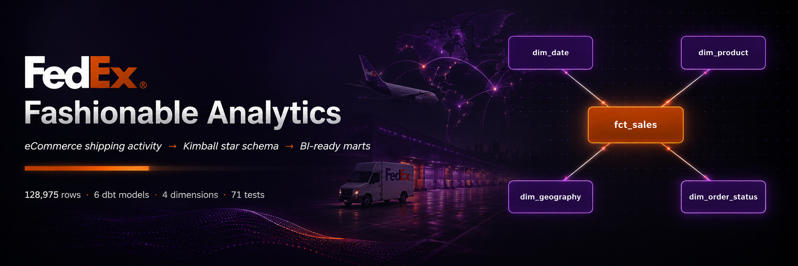

# Fashionable Analytics

A dbt project that transforms a raw eCommerce sales CSV into a Kimball star schema for sales and marketing analysis.

The model supports analysis by:

* Product and category
* Geography
* Date
* Order status
* Fulfilment and sales channel

## Architecture

```text
CSV
 │
 ▼
raw.fashionable_sales_raw
 │
 ▼
stg_fashionable__orders
 │
 ├── dim_date
 ├── dim_product
 ├── dim_geography
 ├── dim_order_status
 │
 ▼
fct_sales
```

The layers are:

* `raw`: original source data
* `seeds`: reference data
* `staging`: cleaned and typed source data
* `marts`: dimensions and fact tables used for reporting

## Project Structure

```text
fashionable-analytics-assessment/
├── data/raw/                  Source CSV
├── scripts/
│   ├── load_raw.py            Loads CSV into DuckDB
│   ├── profile_raw.sql        Data profiling queries
│   └── build_bi_charts.py     Generates BI charts
├── warehouse/                 Local DuckDB database
├── dbt/
│   ├── models/staging/            Cleaned source models
│   ├── models/marts/              Dimensions and fact table
│   ├── models/DATA_QUALITY_STRATEGY.md   dbt-docs __overview__ (landing page for `dbt docs serve`)
│   ├── seeds/                     State-to-region lookup
│   ├── tests/                     Custom data-quality tests
│   ├── macros/                    Reusable dbt macros
│   ├── dbt_project.yml
│   └── profiles.yml
├── presentations/
│   ├── charts/
│   └── final_deck.pptx
├── assets/banner.png             README banner image
├── FUTURE_IMPROVEMENTS.md
├── requirements.txt
└── README.md
```

## Warehouse Models

| Schema    | Model                     | Purpose                 |
| --------- | ------------------------- | ----------------------- |
| `raw`     | `fashionable_sales_raw`   | Original CSV data       |
| `seeds`   | `state_to_region`         | State-to-region mapping |
| `staging` | `stg_fashionable__orders` | Cleaned order lines     |
| `marts`   | `dim_date`                | Date dimension          |
| `marts`   | `dim_product`             | Product dimension       |
| `marts`   | `dim_geography`           | Geography dimension     |
| `marts`   | `dim_order_status`        | Order-status dimension  |
| `marts`   | `fct_sales`               | Sales fact table        |

The fact-table grain is one row per:

```text
order_id × sku
```

## Setup

Requirements:

* Python 3.11.13
* dbt-duckdb

Create and activate the virtual environment:

```bash
PYENV_VERSION=3.11.13 python -m venv .venv
source .venv/bin/activate
pip install -r requirements.txt
```

Export the dbt env vars once per shell session so you don't have to pass
`--project-dir` and `--profiles-dir` on every command:

```bash
export DBT_PROJECT_DIR=$PWD/dbt
export DBT_PROFILES_DIR=$PWD/dbt
export DBT_DUCKDB_PATH=$PWD/warehouse/fashionable.duckdb
```

## Build the Project

Load the source CSV:

```bash
python scripts/load_raw.py
```

Install dbt packages:

```bash
dbt deps
```

Load seed files:

```bash
dbt seed
```

Build models and run tests:

```bash
dbt build
```

Expected result:

```text
6 models built
71 tests passed
```

## dbt Documentation

Generate and open dbt documentation:

```bash
dbt docs generate
dbt docs serve
```

The documentation includes:

* Model lineage
* Column descriptions
* Model dependencies
* Test coverage

## Generate Charts

```bash
python scripts/build_bi_charts.py
```

Output:

```text
presentations/charts/
```

The interview deck (`presentations/final_deck.pptx`) is committed as a
static artefact — the script that generated it is not part of the
committed pipeline.

## Example Query

```sql
select
    p.product_style,
    sum(f.quantity) as units,
    round(sum(f.revenue_amount), 2) as revenue_inr
from marts.fct_sales f
join marts.dim_product p
    using (product_key)
join marts.dim_geography g
    using (geography_key)
join marts.dim_order_status s
    using (status_key)
where g.ship_city = 'MUMBAI'
  and s.status_group in ('Delivered', 'Shipped')
group by p.product_style
order by units desc
limit 5;
```

This query returns the top five product styles in Mumbai for delivered or shipped orders.

## DuckDB Locking

DuckDB allows only one writer at a time.

If DBeaver is connected in write mode, dbt may return a locking error.

Solutions:

1. Close DBeaver before running dbt.
2. Set the DBeaver connection to read-only mode.

## Additional Documentation

* `dbt/models/DATA_QUALITY_STRATEGY.md`: the CLEAN / KEEP / FLAG / EXCLUDE / TEST buckets — also rendered as the landing page of `dbt docs serve` (`http://localhost:8080/#!/overview`)
* `FUTURE_IMPROVEMENTS.md`: what would be added in a production environment
* `presentations/final_deck.pptx`: interview presentation (21 slides)

## Project Status

The following components are complete:

* Raw-data loading
* Data profiling
* Staging transformations
* Kimball star schema
* Data-quality tests
* dbt documentation
* BI charts
* Interview presentation
